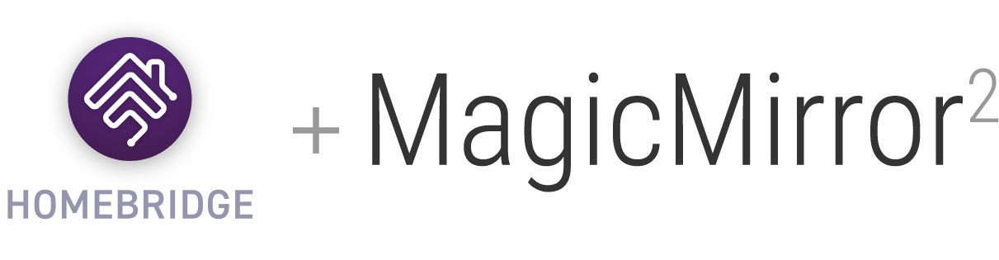

  

# Homebridge MagicMirror2 Plugin

> Add your MagicMirror in Apple HomeKit!

## :exclamation: Requirements

**This plugin require a [MMM-Remote-Control] on your mirror for working!**

## Features

- 🖥 Turn On/Off monitor and each MagicMirror Module in [MagicMirror]
- ☀️ Change brightness interface

[MagicMirror]: https://magicmirror.builders
[MMM-Remote-Control]: https://github.com/Jopyth/MMM-Remote-Control
